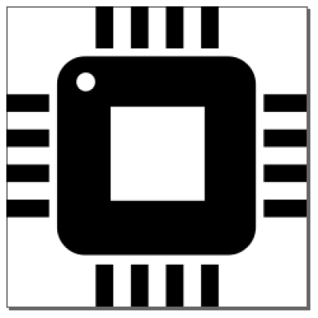
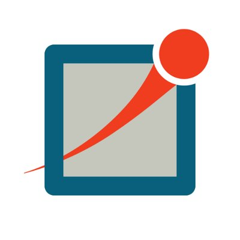

 <!--  -->
 <!--
 [

](#executive-summary)
-->
### **EXECUTIVE SUMMARY**

 Graduate student at the ⚔️University of Central Florida⚔️, currently working as a research assistant at<a href="https://nwsl.ece.ucf.edu/"> NWSL LAB</a> on wireless communication, embedded systems and Machine Learning. 🚓Pursuing a
PhD at the forefront of free space optical communication, with a proven track record in enhancing traffic safety through connected and autonomous vehicle technologies.

Previously worked in Huawei Technologies as project control manager for wireless and software products.
Completed B.Sc. in Electrical and Electronic Engineering from <a href="https://www.iutoic-dhaka.edu">I.U.T</a>.
My thesis was on NB IoT and wireless network.I have voluntarily worked at IUT RObotics clubs and was the team lead of IUT MARS ROVER Team Avijatrik<a href="https://www.facebook.com/IUTAvijatrik"> [2018-19]</a>. 

 

<!-- 
Previously worked in Huawei Technologies as project control manager for wireless and software products.

Completed B.Sc. in Electrical and Electronic Engineering from <a href="https://www.iutoic-dhaka.edu">I.U.T</a>.
My thesis was on NB IoT and wireless network.I have voluntarily worked at IUT RObotics clubs and was the team lead of IUT MARS ROVER Team Avijatrik<a href="https://www.facebook.com/IUTAvijatrik"> [2018-19]</a>. 

📬 IF you want to discuss something, [***post here.***](https://github.com/zaheenSyed/ZaheenSyed/discussions) -->

<!--   

  -->

### My Research Interest: 
- Machine Learning📊
- Wireless Communication
- Robotics🤖
- Internet of things
- Embedded Systems 💻|

<!-- 
### Let's Connect :telephone:

	
	
	

-->

<!-- languages -->
<!-- ### Skills: 

|Languages                      |  Tools and Software|
|----------------------------- | ------------------------------|
|1. **Python** [][python]   | - **VS Code** [][VS code]
|2. **R** [][R]               | - **Jupyter Notebook** [][jupyter]
|3. **C and C++** [][C]       | - **MySQL** [][mysql]
|4. **MATLAB** [][MATLAB] | - **Git** [][git]
|5. **Verilog** [][verilog]   | - **Terminal** [][terminal]
|6. **HTML** [ ][HTML] | - **Linux** [][linux]
|7. **Markdown** [ ][markdown] | - **OMNET** [][OMNET]
|8. **SQL** [][SQL]       | - **SUMO Software** [][SUMO]| -->

<!--
 1. **python** [][python]
 2. **R** [][R]
 3. **C and C++** [][C]
	
 4. **MATLAB**[][MATLAB]
 5. **Verilog**[][verilog]
 6. **HTML**[ ][HTML]
 7. **markdown**[ ][markdown] 
 8. **SQL**[][SQL]

  ### Tools and Software :
- **vs code**[][VS code]
- **Jupyter Notebook**[][jupyter]
- **mySQL**[][mysql]
- **git**[][git]
- **terminal** [][terminal]
- **Linux** [][linux]
	
- **OMNET**[][OMNET]
  
- **SUMO Software**[][SUMO]
- **EXCEL**
- **PowerBI** [][BI]
-->

<!-- #### Robotics and Embedded Systems:

- Microcontroller and PCB design: Arduino, Raspberry Pi, Protease
- XILINX FPGA Programming: Verilog
- PCB Circuit Design: Proteus

#### Machine Learning Experience:

- Supervised and Unsupervised model implemented:
  - Random Forest, SVM, XG boosting, K Means, PCA, DBSCAN
- Deep Neural Network:
  - CNN, Fast RCNN, LSTM, GAN, Transformer, Autoencoders

#### Networking:

- Familiar with modulation techniques:
  - FDMA
- 4G and 5G architecture
- Networking protocols:
  - TCP/IP
- Telecommunication standardizations:
  - 3GPP

#### Computer Vision:

- Applied YoLoV3 and v4 to develop real-time ADAS system for Connected Vehicles. -->

<!--
***Interested and learning in progress (essentials for web development) :***

    
 
 

-->

<!-- ### Publication: 

<a href="https://scholar.google.com/citations?user=IELgvgEAAAAJ&hl=en"> Visit google scholar</a>

 -->

<!-- ### PROJECTS

#### Robotic Project (2023) 🤖: Real-time Crash and Pedestrian Detection System using Internet of Vehicle.

- Used two Raspberry Pi’s as client and server to prototype two mobile nodes.
- Created an ad hoc network with a Mosquito Net server and 2.4 GHz WiFi network.
- Implemented tiny ML models to detect crashes and pedestrians from real-time dash cam feed (computer vision) at the client side for broadcast warning messages.
- Used C and Python programming language.

#### Simulation Project (2021) 🚗: Co-Simulation Study to Assess the Impacts of Connected and Autonomous Vehicles (CAV).

- Funded by SAFERSIM project to integrate a large-scale traffic simulator with communication simulator like OMNET for CAVs.

#### Mars Rover Project (2017 - 2019) 🚀:

- Spearheaded the development of a versatile Mars rover, showcasing expertise in both hardware and software, from Arduino-based programming to PCB design, circuitry, and integrated sensor systems.
- Designed Robotic Arm with 6 DOF using STM 32 micro-controller and Raspberry Pi for motor control and sensor detection.
- Developed a 100 m LOS communication setup using 5 GHz IEEE 802.11 standard for real-time video transfer and rover control.
- Designed custom PCB circuits for power control with buck-boost converter and implemented L298 motor controller. -->

<!-- 
### Research Interests:

- **Free Space Optical Communication (FSO) 🌐**: Exploring agile, and robust algorithm to discover and maintain nodes using FSO. 
- **Reinforcement Learning & Deep Neural Networks (RL & DNN) 🤖**: Developing intelligent systems that learn and make decisions.
- **Embedded Systems with FPGA 🛠️**: Utilizing FPGA for implementing Software-Defined Networks (SDN) to enhance robustness in sensing and networking.
- **Wireless Communication 📡**: Develop and implement algorithm for wireless commincation networks for real time applications like connected vehicles.
- **NB-IoT and M2M Communication 🤖📶**: Investigating Narrowband IoT and Machine-to-Machine communication for efficient data transfer.
- **V2X Technology 🚗🤝**: Researching Vehicle-to-Everything communication for smarter transportation systems.
- **5G 📶**: Exploring the next generation of mobile communication technology.
- **Networking 🌐**: Investigating the structure and function of networks for efficient data transfer. -->
<!-- 
⚡ ***Fun fact***:

- 👯 I’m looking to collaborate on embedded system projects.
- 🤔 Learning is a continuous process and there is no end to. I tend to learn through experience and projects.
- :pencil2: Lately I discovered that blogging and writing articles are great for learning. 
- :musical_note: THere are two ways to do boring job done: music and automation. -->

[UNMD LAB]:https://www.cecs.ucf.edu/shasan/

[python]: https://www.python.org/
[R]: https://www.r-project.org/
[C]:https://github.com/topics/c
[VS code]: https://code.visualstudio.com/
[python]: https://github.com/topics/python
[MATLAB]: https://github.com/topics/matlab
[HTML]: https://github.com/topics/html
[SQL]: https://github.com/topics/sql
[verilog]: https://github.com/topics/verilog
[mysql]:https://github.com/topics/mysql
[git]: https://github.com/topics/git
[BI]: https://docs.microsoft.com/en-us/power-bi/
[terminal]: https://github.com/topics/terminal
[linux]:https://github.com/topics/linux
[markdown]:https://github.com/topics/markdown
[jupyter]:https://github.com/topics/jupyter-notebook
[sumo]: https://www.eclipse.org/sumo/
[OMNET]: https://omnetpp.org/
[google scholar]: https://scholar.google.com/citations?user=IELgvgEAAAAJ&hl=en

<!--

 Thanks in details 

 
  <i><b>Want to play?</b></i>  
    

<!-- THIS PART TEACH ME TO HOW TO MAKE DROP DOWN -->

 <b> <samp> Light bonfire </samp></b>

<samp>
 <b><h2 style="color: #fc6203">B O N F I R E &nbsp; L I T !</h2> </b>

</samp>

-->

